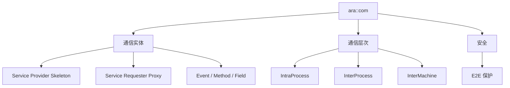

**Communication Management（通信管理，`ara::com`）** 是 AP 的基础功能簇，在自适应应用之间实现**面向服务的通信（SOA）**，覆盖进程内、进程间、跨机各层级。它由生成的**服务提供者骨架（Skeleton）**与**服务请求者代理（Proxy）**、以及可选的通用通信管理器构成，并提供内建的**E2E 保护**安全机制。

> [!info] 一句话定位
> AP 的「服务总线」：应用之间不点对点连线，而是按服务（Event / Method / Field）收发。

## 规范信息

| 项目 | 内容 |
| --- | --- |
| 平台 | AP |
| 类别 | SWS — 软件模块规范（Software Specification） |
| UID | 717 |
| 版本 | R25-11 |
| 本地 PDF | [AUTOSAR_AP_SWS_CommunicationManagement.pdf](file:///F:/Work/Standards/01_Sources/AP_SWS_CommunicationManagement_717/AUTOSAR_AP_SWS_CommunicationManagement.pdf) |
| 纯文本全文 | [AP_SWS_CommunicationManagement.complete.txt](file:///F:/Work/Standards/01_Sources/AP_SWS_CommunicationManagement_717/zzgen/AP_SWS_CommunicationManagement.complete.txt) |

## 知识体系

## 核心要点

- **功能范围**：为自适应应用提供面向服务的通信，覆盖进程内、进程间、跨机各层级。
- **构成**：生成的服务提供者骨架与服务请求者代理，外加可选的通用 Communication Manager（负责集中式 brokering 与配置）。
- **安全内建**：提供内建的 **E2E 保护**机制，可用于事件与方法的所有通信层级。
- **配套文档**：通信管理由两份文档构成——[[ARAComAPI]]（解释设计与行为）与本文档（`ara::com` API 的需求）。**建议先读 ARAComAPI 建立理解，再读本文档。**
- **关于内部接口**：AUTOSAR 不标准化**仅在功能簇之间使用**的接口，以允许依赖具体 OS 的高效实现；功能簇之间的交互只给出信息性指引，不含语法细节，内部接口由平台供应商决定。

## 依赖关系

- 前置阅读 [[ARAComAPI]]；与 [[Core]]、[[ExecutionManagement]]、[[StateManagement]] 等功能簇交互；安全侧依赖 E2E（FO）。

## 相关

- [[ARAComAPI]]
- [[Core]]
- [[ExecutionManagement]]
- [[StateManagement]]
- [[AP]]
- [[规范模块]]
