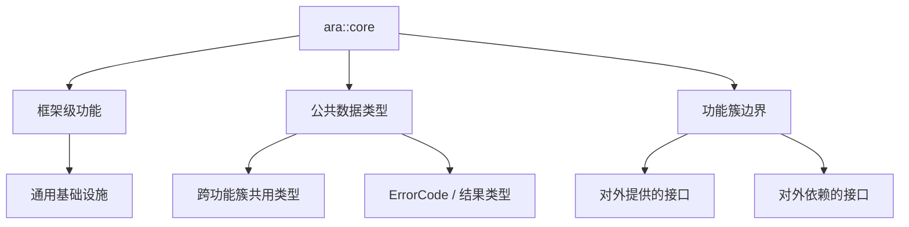

**Core（`ara::core`，自适应平台核心）** 是 AP 的基础功能簇，定义适用于**整个框架**的功能，并定义一组被多个功能簇作为公共接口使用的**通用数据类型**。

> [!info] 一句话定位
> AP 的「标准库底座」：整个框架通用的类型与基础设施，其它功能簇都建立在它之上。

## 规范信息

| 项目 | 内容 |
| --- | --- |
| 平台 | AP |
| 类别 | SWS — 软件模块规范（Software Specification） |
| UID | 903 |
| 版本 | R25-11 |
| 本地 PDF | [AUTOSAR_AP_SWS_Core.pdf](file:///F:/Work/Standards/01_Sources/AP_SWS_Core_903/AUTOSAR_AP_SWS_Core.pdf) |
| 纯文本全文 | [AP_SWS_Core.complete.txt](file:///F:/Work/Standards/01_Sources/AP_SWS_Core_903/zzgen/AP_SWS_Core.complete.txt) |

## 知识体系

## 核心要点

- **定位**：描述 Core 功能簇的功能、API 与配置，并定义适用于**整个框架**的功能。
- **公共数据类型**：定义一组被多个功能簇在**公共接口**中使用的通用数据类型。
- **关于内部接口**：与 [[CommunicationManagement]] 一致，AUTOSAR 不标准化仅在功能簇之间使用的接口，以允许依赖具体 OS 的高效实现；文档只给出 Core 与其它功能簇交互的**信息性**指引，列出 Core 对外提供的接口与对外依赖的接口，不含语法细节。

## 依赖关系

- 被 [[CommunicationManagement]]、[[ExecutionManagement]]、[[StateManagement]] 等功能簇广泛依赖。

## 相关

- [[CommunicationManagement]]
- [[ExecutionManagement]]
- [[StateManagement]]
- [[AP]]
- [[规范模块]]
