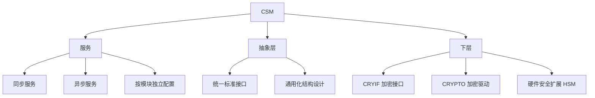

**CSM（Crypto Service Manager，加密服务管理器）** 是 CP 的加密栈顶层模块，为所有软件模块提供**唯一的加密功能访问入口**：以标准化接口向高层屏蔽底层加密库与硬件的差异，并可为每个软件模块**单独配置**加密服务。

> [!info] 一句话定位
> 加密能力的「统一窗口」：上层只调 CSM，具体用软件库还是硬件加密由下层决定。

## 规范信息

| 项目 | 内容 |
| --- | --- |
| 平台 | CP |
| 类别 | SWS — 软件模块规范（Software Specification） |
| UID | 402 |
| 版本 | R25-11 |
| 本地 PDF | [AUTOSAR_CP_SWS_CryptoServiceManager.pdf](file:///F:/Work/Standards/01_Sources/CP_SWS_CryptoServiceManager_402/AUTOSAR_CP_SWS_CryptoServiceManager.pdf) |
| 纯文本全文 | [CP_SWS_CryptoServiceManager.complete.txt](file:///F:/Work/Standards/01_Sources/CP_SWS_CryptoServiceManager_402/zzgen/CP_SWS_CryptoServiceManager.complete.txt) |

## 知识体系

## 核心要点

- **定位**：提供同步或异步服务，为所有软件模块提供**独一无二**的加密功能访问；向高层提供标准化的抽象层。
- **可配置性**：不同软件模块所需的加密功能可能不同，因此 CSM 的服务可以**按模块单独配置与初始化**，包括选择同步或异步处理。
- **通用化设计**：凡详细的结构与接口定义会限制可用性的地方，都以通用方式定义接口与结构，为未来扩展留空间。
- **访问下层**：CSM 访问 **CRYIF（加密接口）**，并使用其与底层 **CRYPTO 加密驱动**的接口来计算加密服务结果；底层加密库模块或驱动的硬件扩展提供 SHA-1、RSA、AES、Diffie-Hellman 密钥交换等算法。

## 依赖关系

- 依赖 CRYIF / CRYPTO / HSM；被 [[E2ELibrary]]、SecOC、诊断安全访问等使用。

## 相关

- [[E2ELibrary]]
- [[DiagnosticCommunicationManager]]
- [[CP]]
- [[规范模块]]
