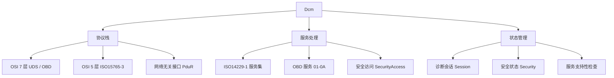

**Dcm（Diagnostic Communication Manager，诊断通信管理）** 是 CP 基础软件模块，为诊断服务提供**统一 API**，供外部诊断工具在开发、生产或售后阶段使用。它实现诊断协议的 **OSI 5~7 层**，管理诊断会话与安全状态，判断服务是否受支持、在当前会话下能否执行。

> [!info] 一句话定位
> 诊断请求的「总机」：接收 PduR 送来的诊断报文，按 UDS / OBD 规范解析、鉴权、执行与应答。

## 规范信息

| 项目 | 内容 |
| --- | --- |
| 平台 | CP |
| 类别 | SWS — 软件模块规范（Software Specification） |
| UID | 018 |
| 版本 | R26-11 |
| 本地 PDF | [AUTOSAR_CP_SWS_DiagnosticCommunicationManager.pdf](file:///F:/Work/Standards/01_Sources/CP_SWS_DiagnosticCommunicationManager_018/AUTOSAR_CP_SWS_DiagnosticCommunicationManager.pdf) |
| 纯文本全文 | [CP_SWS_DiagnosticCommunicationManager.complete.txt](file:///F:/Work/Standards/01_Sources/CP_SWS_DiagnosticCommunicationManager_018/zzgen/CP_SWS_DiagnosticCommunicationManager.complete.txt) |

## 知识体系

## 核心要点

- **协议层**：提供诊断协议的 OSI **5~7 层**。第 7 层提供大量 ISO 14229-1（UDS）服务，并支持法规要求的 OBD 服务（$01–$0A），可满足全球轻型车 OBD 法规（California OBDII、EOBD、Japan OBD 等）。第 5 层处理 ISO 15765-3 / ISO 15765-4 中与网络无关的部分。
- **网络无关**：Dcm 本身网络无关，CAN / LIN / FlexRay / MOST 等网络相关的功能在 Dcm 之外处理；由 [[PDURouter]] 提供网络无关接口，Dcm 从 PduR 接收诊断报文并内部处理。
- **状态管理**：管理诊断会话（Session）与安全状态（Security），并据此判断某诊断服务能否在当前状态下执行。
- **位置**：位于通信服务（Service Layer）。

## 依赖关系

- 依赖 [[PDURouter]] 送来的诊断报文；与 [[DiagnosticEventManager]]（读取 DTC）、[[COMManager]]、[[NVRAMManager]] 等交互。

## 相关

- [[DiagnosticEventManager]]
- [[PDURouter]]
- [[NVRAMManager]]
- [[CP]]
- [[规范模块]]
