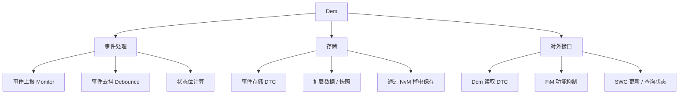

**Dem（Diagnostic Event Manager，诊断事件管理）** 是 CP 服务组件，负责**处理与存储诊断事件（故障）**及其关联数据，并向 [[DiagnosticCommunicationManager]] 提供故障信息（如读取全部已存储的 DTC），同时向应用层与其它 BSW 模块提供接口。

> [!info] 一句话定位
> 「故障存储器」：记录发生了什么错、严重程度如何，并按规则决定点不点亮故障灯。

## 规范信息

| 项目 | 内容 |
| --- | --- |
| 平台 | CP |
| 类别 | SWS — 软件模块规范（Software Specification） |
| UID | 019 |
| 版本 | R25-11 |
| 本地 PDF | [AUTOSAR_CP_SWS_DiagnosticEventManager.pdf](file:///F:/Work/Standards/01_Sources/CP_SWS_DiagnosticEventManager_019/AUTOSAR_CP_SWS_DiagnosticEventManager.pdf) |
| 纯文本全文 | [CP_SWS_DiagnosticEventManager.complete.txt](file:///F:/Work/Standards/01_Sources/CP_SWS_DiagnosticEventManager_019/zzgen/CP_SWS_DiagnosticEventManager.complete.txt) |

## 知识体系

## 核心要点

- **目标**：为整车厂与零部件供应商定义一套统一的「诊断故障存储器」方案。
- **主要职责**：处理与存储诊断事件及关联数据；向 Dcm 提供故障信息（如读出全部 DTC）；向应用层与 BSW 提供接口。
- **关键交互**：
  - **FiM（功能抑制管理）**：Dem 在监控状态变化时通知 FiM，以按依赖关系停止 / 释放功能实体；
  - **Dcm**：负责 UDS 与 SAE J1979 通信路径及诊断服务执行，组装响应（DTC、状态信息等）回传诊断仪；
  - **J1939Dcm**：负责 SAE J1939-73 诊断通信协议；
  - **NvM**：提供 NVRAM 块以**掉电保存** UDS 状态信息与关联数据；
  - **EcuM**：负责基本的初始化与反初始化。
- **监控器（Monitor）** 是 SWC / BSW 模块的子组件；SWC 与 BSW 可更新 / 查询当前监控状态与 UDS 状态信息。
- 部分内部行为属厂商特定，见规范的 Limitations 章节。

## 依赖关系

- 依赖 [[NVRAMManager]]（持久化）、[[ECUStateManager]]（初始化）；与 [[DiagnosticCommunicationManager]]、FiM、J1939Dcm 协作。

## 相关

- [[DiagnosticCommunicationManager]]
- [[NVRAMManager]]
- [[ECUStateManager]]
- [[CP]]
- [[规范模块]]
