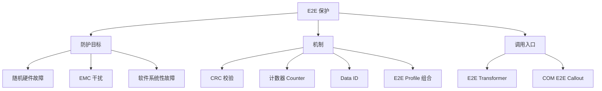

**E2E Library（端到端保护库）** 实现 AUTOSAR 基础文档《E2E Protocol Specification》的平台相关部分，为**安全相关（safety-related）**的数据交换在运行时提供端到端保护，防护等级可达 **ASIL D**。

> [!info] 一句话定位
> 通信链路的「防伪封条」：给安全数据加校验（CRC、计数器等），收端验伪、识别故障。

## 规范信息

| 项目 | 内容 |
| --- | --- |
| 平台 | CP |
| 类别 | SWS — 软件模块规范（Software Specification） |
| UID | 428 |
| 版本 | R25-11 |
| 本地 PDF | [AUTOSAR_CP_SWS_E2ELibrary.pdf](file:///F:/Work/Standards/01_Sources/CP_SWS_E2ELibrary_428/AUTOSAR_CP_SWS_E2ELibrary.pdf) |
| 纯文本全文 | [CP_SWS_E2ELibrary.complete.txt](file:///F:/Work/Standards/01_Sources/CP_SWS_E2ELibrary_428/zzgen/CP_SWS_E2ELibrary.complete.txt) |

## 知识体系

## 核心要点

- **防护对象**：通信链路中运行时的故障，例如：随机硬件故障（如 CAN 收发器寄存器损坏）、干扰（EMC）、以及实现 VFB 通信的软件（RTE、IOC、COM、网络栈）里的系统性故障。
- **防护原理**：在待发送的安全数据上附加**控制数据**（CRC、计数器、Data ID 等）；接收时用这些控制数据校验，若判定故障则上报给接收方 SWC 处理。
- **E2E Profile**：AUTOSAR 定义了一组**灵活的 E2E Profile**，每个 Profile 行为固定，但提供功能参数级的配置项（如 CRC 相对数据的位置）。
- **调用入口**：① **E2E Transformer**（R4.2.1 起的标准化调用方式）；② **COM E2E Callout**。无论从哪调用，E2E 保护都作用于数据元素，且基于**序列化后、与总线一致的位布局**进行。

## 依赖关系

- 功能规范主体在 FO 文档《E2E Protocol Specification》（[E2EProtocol](file:///F:/Work/AUTOSAR_Module_Notes/FO/PRS/E2EProtocol.md)）；与 [[RTE]]、[[COM]]、E2E Transformer 紧密相关。

## 相关

- [[COM]]
- [[RTE]]
- [[CryptoServiceManager]]
- [[FO]]
- [[CP]]
- [[规范模块]]
