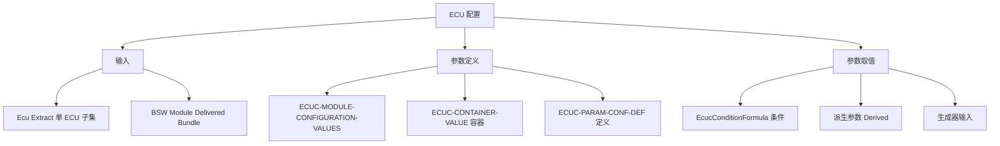

**ECUConfiguration（ECU 配置）** 是 CP 模板规范（TPS），定义**ECU 配置参数的定义（Parameter Definition）与取值（Values）**：每个 BSW 模块怎样被配置、参数之间如何约束、以及配置结果如何作为生成器的输入。

> [!info] 一句话定位
> 配置工具与生成器之间的「参数契约」：定义每个模块可配什么、取值范围与依赖关系。

## 规范信息

| 项目 | 内容 |
| --- | --- |
| 平台 | CP |
| 类别 | TPS — 模板规范（Template Specification） |
| UID | 087 |
| 版本 | R26-11 |
| 本地 PDF | [AUTOSAR_CP_TPS_ECUConfiguration.pdf](file:///F:/Work/Standards/01_Sources/CP_TPS_ECUConfiguration_087/AUTOSAR_CP_TPS_ECUConfiguration.pdf) |
| 纯文本全文 | [CP_TPS_ECUConfiguration.complete.txt](file:///F:/Work/Standards/01_Sources/CP_TPS_ECUConfiguration_087/zzgen/CP_TPS_ECUConfiguration.complete.txt) |

## 知识体系

## 核心要点

- **在方法论中的位置**：ECU 配置是「Integrate Software for ECU」活动的主体。配置过程从**把系统描述拆分为单 ECU 描述**开始：`Ecu Extract` 与 `BSW Module Delivered Bundle` 是 ECU 配置步骤的两个输入。
- **配置对象**：ECU 配置过程中，架构中每个模块都可按本 ECU 需求单独配置；由于模块众多且互有依赖，需要工具支持（AUTOSAR ECU Configuration Editor）。
- **两类描述**：
  - **ECU Configuration Parameter Definition**：描述配置参数及其约束（配置类、取值范围、多重性等），是**工具的输入**；
  - **ECU Configuration Values**：配置后的取值，既可作为其它配置工具的输入，也是**生成器的基础**。
- **条件与派生**：配置值可由其它配置参数**计算派生**；容器 / 参数 / 引用定义的**存在性**可依赖其它参数取值（如某开关参数设为特定值时才生效），由 `EcucConditionFormula.ecucQuery` 表达（该属性恒为必填）。

## 依赖关系

- 输入来自 [[SystemTemplate]] 的 ECU Extract；为 [[RTE]] 生成与各 BSW 模块代码生成提供参数定义。

## 相关

- [[SystemTemplate]]
- [[RTE]]
- [[方法论]]
- [[CP]]
- [[规范模块]]
