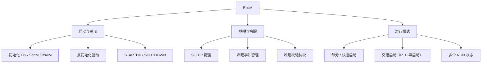

**EcuM（ECU State Manager，ECU 状态管理）** 是 CP 基础软件模块，负责管理 ECU 的**共性状态**：初始化 / 反初始化 OS、SchM、BswM 与部分底层驱动，按请求把 ECU 置入 SLEEP / SHUTDOWN，并管理 ECU 上所有**唤醒事件（Wakeup）**。

> [!info] 一句话定位
> ECU 的「开机 / 关机 / 睡眠 / 唤醒」总管，尤其负责 BswM 尚不可用的那些早期与晚期阶段。

## 规范信息

| 项目 | 内容 |
| --- | --- |
| 平台 | CP |
| 类别 | SWS — 软件模块规范（Software Specification） |
| UID | 078 |
| 版本 | R25-11 |
| 本地 PDF | [AUTOSAR_CP_SWS_ECUStateManager.pdf](file:///F:/Work/Standards/01_Sources/CP_SWS_ECUStateManager_078/AUTOSAR_CP_SWS_ECUStateManager.pdf) |
| 纯文本全文 | [CP_SWS_ECUStateManager.complete.txt](file:///F:/Work/Standards/01_Sources/CP_SWS_ECUStateManager_078/zzgen/CP_SWS_ECUStateManager.complete.txt) |

## 知识体系

## 核心要点

- **核心职责**：初始化与反初始化 OS、SchM、BswM 及部分基础软件驱动；按请求把 ECU 置入 SLEEP / SHUTDOWN；管理所有唤醒事件。
- **唤醒校验协议**：区分「真实唤醒事件」与「误唤醒（erratic）」。
- **灵活启动方式**：支持**部分 / 快速启动**（先以有限能力启动，再逐步扩展）、**交错启动**（尽早启动 RTE 运行业务，再继续启动其余 BSW 与 SWC）、**多个运行状态**（RUN → SLEEP 形成连续谱）。
- **多核协调**：在多个核心上协调 STARTUP / SHUTDOWN / SLEEP / WAKEUP。
- **与通用模式管理协作**：灵活 ECU 管理依赖 RTE / BSW Scheduler（合并为统一模块）与 [[BSWModeManager]]（规则与动作）。EcuM 主要在通用模式设施不可用时接管：早期 STARTUP、晚期 SHUTDOWN、以及被调度器锁定的 SLEEP 阶段。UP 阶段之后由 BswM 负责后续动作，EcuM 仲裁来自 SWC 的 RUN 与 POST_RUN 请求并通知 BswM。

## 依赖关系

- 与 [[BSWModeManager]]、[[OS]]、[[RTE]]、[[COMManager]] 等协作。

## 相关

- [[ModeManagementGuide]]
- [[BSWModeManager]]
- [[OS]]
- [[CP]]
- [[规范模块]]
