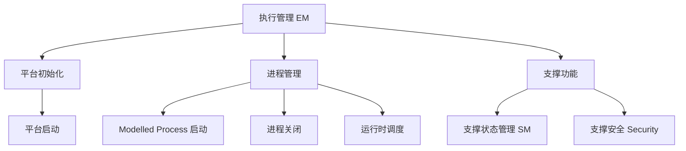

**Execution Management（执行管理，EM）** 是 AP Foundation 里的功能簇，负责**系统执行的所有方面**：平台初始化、应用的**启动与关闭**，并与操作系统协作完成应用的**运行时调度**。

> [!info] 一句话定位
> AP 的「进程总管」：按 Manifest 决定哪些进程何时、以何种方式启动与停止。

## 规范信息

| 项目 | 内容 |
| --- | --- |
| 平台 | AP |
| 类别 | SWS — 软件模块规范（Software Specification） |
| UID | 721 |
| 版本 | R25-11 |
| 本地 PDF | [AUTOSAR_AP_SWS_ExecutionManagement.pdf](file:///F:/Work/Standards/01_Sources/AP_SWS_ExecutionManagement_721/AUTOSAR_AP_SWS_ExecutionManagement.pdf) |
| 纯文本全文 | [AP_SWS_ExecutionManagement.complete.txt](file:///F:/Work/Standards/01_Sources/AP_SWS_ExecutionManagement_721/zzgen/AP_SWS_ExecutionManagement.complete.txt) |

## 知识体系

## 核心要点

- **职责**：负责平台初始化，以及 **Modelled Process** 的启动与关闭。
- **Modelled Process**：自包含的进程（如内部自行控制线程创建）。
- **依据 Manifest 执行**：EM 基于一份或多份 **Manifest** 内容（如可执行文件应何时、以何种方式启动）来完成这些任务。
- **与 OS 协作**：EM 与操作系统配合，并配置 OS 以完成应用的运行时调度。
- **支撑能力**：为 [[StateManagement]]（状态管理）与安全（Security）提供支持。
- **内部接口**：与其它功能簇之间的接口不作语法标准化，仅为信息性指引。

## 依赖关系

- 与 [[StateManagement]]、[[CommunicationManagement]]、[[Core]] 及 OS 交互。

## 相关

- [[StateManagement]]
- [[CommunicationManagement]]
- [[Core]]
- [[PlatformDesign]]
- [[AP]]
- [[规范模块]]
