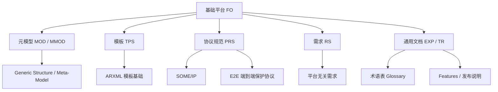

**基础平台（Foundation，FO）** 是 CP 与 AP 共用的**通用规范集合**：它定义元模型与模板的底层规则、安全机制、协议规范（SOME/IP、E2E）、术语表与发布说明等，是另外两个平台的「共同地基」。

> [!info] 一句话定位
> FO = CP 与 AP 都要用到的**公共基础规范**（元模型、协议、安全、术语）。

## 构成

## 类别统计

| 类别 | 数量 | 说明 |
| --- | --- | --- |
| EXP | 7 | 解释性指南 |
| RS | 19 | 通用需求规范 |
| TR | 10 | 技术报告 |
| TPS | 8 | 模板规范 |
| PRS | 13 | 协议规范（Protocol Specification） |
| MOD | 5 | 元模型 |
| MMOD | 2 | 元模型基础 |
| ASWS | 1 | 自适应软件规范 |

## 精选通用文档

下面是 FO 中蕞常被引用的通用文档（点开可查看本地规范笔记原件）：

| 文档 | 主题 | 类别 |
| --- | --- | --- |
| [Glossary](file:///F:/Work/AUTOSAR_Module_Notes/FO/TR/Glossary.md) | AUTOSAR 术语表（查概念必看） | TR |
| [Features](file:///F:/Work/AUTOSAR_Module_Notes/FO/TR/Features.md) | 各版本特性总览 | TR |
| [SWArchitecturalDecisions](file:///F:/Work/AUTOSAR_Module_Notes/FO/EXP/SWArchitecturalDecisions.md) | CP / AP 架构决策说明 | EXP |
| [SecurityOverview](file:///F:/Work/AUTOSAR_Module_Notes/FO/EXP/SecurityOverview.md) | 安全总览 | EXP |
| [SafetyOverview](file:///F:/Work/AUTOSAR_Module_Notes/FO/EXP/SafetyOverview.md) | 功能安全总览 | EXP |
| [TimeSensitiveNetworkFeatures](file:///F:/Work/AUTOSAR_Module_Notes/FO/EXP/TimeSensitiveNetworkFeatures.md) | TSN 时间敏感网络 | EXP |
| [E2EProtocol](file:///F:/Work/AUTOSAR_Module_Notes/FO/PRS/E2EProtocol.md) | E2E 端到端保护协议 | PRS |
| [SOMEIPProtocol](file:///F:/Work/AUTOSAR_Module_Notes/FO/PRS/SOMEIPProtocol.md) | SOME/IP 协议 | PRS |
| [XMLSchemaSupplement](file:///F:/Work/AUTOSAR_Module_Notes/FO/TR/XMLSchemaSupplement.md) | ARXML 的 XSD 补充说明 | TR |

> [!note] 与 CP / AP 的关系
> FO 里的 **E2E 协议** 由 CP 的 [[E2ELibrary]] 与 AP 的 [[CommunicationManagement]] 实现；**SOME/IP** 在 CP 由 [[SOMEIPTransformer]] 序列化，在 AP 由 ara::com 承载。

## 相关

- [[AUTOSAR]]
- [[标准与规范]]
- [[CP]] ｜ [[AP]]
- [[规范模块]]
