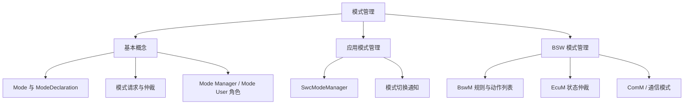

`ModeManagementGuide` 是 CP 解释性指南（EXP），系统讲解 AUTOSAR **模式管理（Mode Management）**：模式是什么、模式切换如何实现、模式管理器（Mode Manager）与模式使用者（Mode User）各自的角色，以及应用模式管理（Application Mode）与基础软件模式管理（BSW Mode）之间的关系。

> [!info] 一句话定位
> CP 里「谁在什么条件下切到什么状态」的统一答案，BswM 是其中的中枢。

## 规范信息

| 项目 | 内容 |
| --- | --- |
| 平台 | CP |
| 类别 | EXP — 解释性指南（Explanation） |
| UID | 440 |
| 版本 | R25-11 |
| 本地 PDF | [AUTOSAR_CP_EXP_ModeManagementGuide.pdf](file:///F:/Work/Standards/01_Sources/CP_EXP_ModeManagementGuide_440/AUTOSAR_CP_EXP_ModeManagementGuide.pdf) |
| 纯文本全文 | [CP_EXP_ModeManagementGuide.complete.txt](file:///F:/Work/Standards/01_Sources/CP_EXP_ModeManagementGuide_440/zzgen/CP_EXP_ModeManagementGuide.complete.txt) |

## 知识体系

## 核心要点

- **基本概念**：模式（Mode）是系统状态的一种抽象；模式切换通过模式管理器下发、模式使用者响应；文档用一套示例 ECU 的代码配置串讲全流程。
- **应用与 BSW 的联动**：应用模式管理（Application Mode）与基础软件模式管理紧密相关，应用侧的模式请求会驱动 BSW 侧动作。
- **BswM 是中枢**：BSW Mode Manager 是 R4.0 起的核心模式管理模块，可高度配置——用**规则（Rule）**评估条件、用**动作列表（Action List）**执行结果，配置方法是本指南的重点。
- **未覆盖的后续工作**：网关 ECU、FlexRay / Ethernet / LIN 的通信管理、DCM 路由路径组、多核 BswM 配置等在文档中列为待补充项。

## 依赖关系

- 依赖 [[BSWModeManager]]（BswM，规则与动作）、[[ECUStateManager]]（EcuM，状态仲裁）、[[COMManager]]（ComM，通信模式）。
- 应用侧模式经 [[RTE]] 传递。

## 相关

- [[BSWDistributionGuide]]
- [[BSWModeManager]]
- [[ECUStateManager]]
- [[COMManager]]
- [[CP]]
- [[规范模块]]
