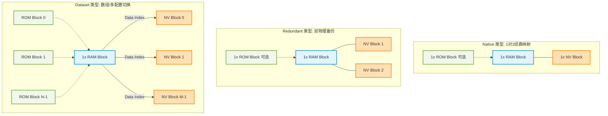
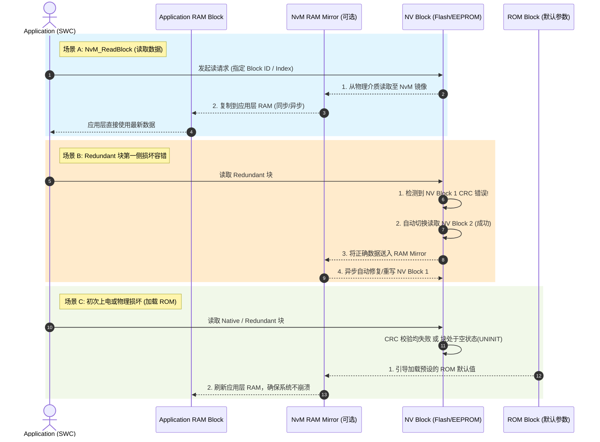

- NvM 的区块类型——Native、Redundant、Dataset 在什么场景下各有用处

  1.在 AUTOSAR 架构的 NvM（非易失性存储管理器） 模块中，Native、Redundant 和 Dataset 是三种核心的块管理类型（Block Management Types）。它们通过不同的 NV 存储结构设计，平衡了存储成本、数据可靠性以及多配置灵活性。 ^[1, 2, 3]
  以下是它们的核心技术特性、适用场景以及直接对比：

---

### 1. Native NVRAM Block (常规块)

- 结构原理：由 1 个 NV 块 + 1 个 RAM 块 + 1 个 ROM 块（可选） 组成。这是最简单、直接的映射方式。 ^[2, 4]
- 适用场景：
- 非安全关键的常规数据：数据偶尔丢失或损坏不会导致系统发生致命故障。
  - 高频更新但有恢复手段的数据：如果读取失败，可以通过加载默认的 ROM 初始值来恢复。 ^[4]
- 典型实例：
- 车辆行驶总里程（Odometer）、单次里程（Trip Meter）。
  - 用户的个性化设置：如后视镜位置、空调偏好温度、车载娱乐系统音量。
  - 非核心诊断参数：例如一般性的状态计数器。 ^[4]

## 2. Redundant NVRAM Block (冗余块)

- 结构原理：由 2 个 NV 块 + 1 个 RAM 块 + 1 个 ROM 块（可选） 组成。每次执行写操作时，数据会被同步写入两个独立的物理 NV 空间。当读取第一个 NV 块时如果发生 CRC 校验错误或读取失败，系统会自动从第二个冗余块中恢复数据并修复破坏的块。 ^[3, 5, 6]
- 适用场景：
- 高安全关键性数据（Safety-Critical）：与车辆动力、制动或功能安全（ASIL 等级要求）直接相关的核心参数，绝不允许因物理扇区损坏或掉电数据损坏而丢失。
  - 不可逆的生命周期数据：一旦丢失会导致控制器“变砖”或无法正常工作的标定信息。
- 典型实例：
- 防盗安全密钥、密码、证书：用于车载以太网或 CAN-FD 核心通信的安全凭证（SecOC）。
  - 安全关键标定参数（Calibration Data）：如传感器零位校准值（如方向盘转角传感器零位）、发动机/电机核心控制映射表。
  - 车架号（VIN 码）。

## 3. Dataset NVRAM Block (数据集块)

- 结构原理：由 M 个 NV 块 + N 个 ROM 块 + 1 个 RAM 块 组成（NV 和 ROM 块的总数在 1 到 256 之间）。它是一组相同数据结构（Data Type）的集合。应用程序在读写前，必须通过 NvM_SetDataIndex() 显式指定要操作的是哪一个“索引（Index）”的数据。 ^[3, 6]
- 适用场景：
- 多版本/多配置切换：同一段代码逻辑，需要根据不同车型、不同区域或不同的工作模式，切换不同套的配置参数。
  - 时间序列或队列数据记录：需要循环或批量记录同一类型状态的历史演变过程。 ^[6]
- 典型实例：
- 故障码（DTC）及冻结帧（Freeze Frames）存储：故障发生时，需要按照特定结构记录多组不同的故障现场数据（如故障 1、故障 2 的环境数据）。
  - 车型通用平台的参数包：同一个 ECU 软件刷写在不同车型上，通过 Dataset 索引在“SUV 模式参数”、“轿车模式参数”、“越野模式参数”之间一键切换。 ^[6]

---

## 直观对比总结

| 特性 / 维度    | Native (常规块)                        | Redundant (冗余块)                   | Dataset (数据集块)                                 |
| -------------- | -------------------------------------- | ------------------------------------ | -------------------------------------------------- |
| NV 块数量      | 1 个                                   | 2 个（双备份）                       | M 个（数组形式，1~256）                            |
| 核心优势       | 节省存储空间，读写效率高               | 高数据容错率与可靠性                 | 高灵活性，支持多配置与索引切换                     |
| 存储成本       | 低                                     | 高（空间开销翻倍）                   | 中等（视配置的数量而定）                           |
| 失效处理机制   | 若 CRC 失败，只能报错或加载 ROM 默认值 | 若一侧损坏，自动从另一侧无感修复恢复 | 通过 Index 区分，若某 Index 损坏通常由应用层做容错 |
| 一句话选型指南 | “丢了影响不大或可以重置的数据”         | “绝对不能死、不容有失的核心数据”     | “结构相同、有多套或需要循环记录的数据”             |

>参考链接： 
---

* [1] [https://bbs.csdn.net](https://bbs.csdn.net/weixin_32349093/article/details/100251078)
* [2] [https://www.eet-china.com](https://www.eet-china.com/mp/a65142.html)
* [3] [https://www.eet-china.com](https://www.eet-china.com/mp/a125404.html)
* [4] [https://blog.csdn.net](https://blog.csdn.net/weixin_42548829/article/details/160878355)
* [5] [https://blog.csdn.net](https://blog.csdn.net/weixin_42967006/article/details/132345639)
* [6] [https://www.eet-china.com](https://www.eet-china.com/mp/a208738.html)
