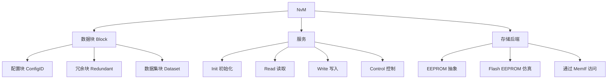

**NvM（NVRAM Manager，非易失 RAM 管理）** 是 CP 基础软件模块，负责按各自需求**存储与维护非易失（NV）数据**，可管理 EEPROM 与 Flash EEPROM 仿真设备上的 NV 数据，并提供同步 / 异步的初始化、读、写、控制服务。

> [!info] 一句话定位
> 「掉电不丢」的数据管家：汽车环境下按块管理 NV 数据，屏蔽底层 EEPROM / Flash 差异。

## 规范信息

| 项目       | 内容                                                                                                                                    |
| ---------- | --------------------------------------------------------------------------------------------------------------------------------------- |
| 平台       | CP                                                                                                                                      |
| 类别       | SWS — 软件模块规范（Software Specification）                                                                                            |
| UID        | 033                                                                                                                                     |
| 版本       | R25-11                                                                                                                                  |
| 本地 PDF   | [AUTOSAR_CP_SWS_NVRAMManager.pdf](file:///F:/Work/Standards/01_Sources/CP_SWS_NVRAMManager_033/AUTOSAR_CP_SWS_NVRAMManager.pdf)         |
| 纯文本全文 | [CP_SWS_NVRAMManager.complete.txt](file:///F:/Work/Standards/01_Sources/CP_SWS_NVRAMManager_033/zzgen/CP_SWS_NVRAMManager.complete.txt) |

## 知识体系

## 核心要点

- **目标**：在汽车环境下，按各数据的个别需求确保 NV 数据的存储与维护。
- **支持设备**：可管理 EEPROM 与 Flash EEPROM 仿真设备上的 NV 数据。
- **服务类型**：提供同步 / 异步的 NV 数据管理与维护服务（init / read / write / control）。
- **块模型**：NV 数据以「块（Block）」为单位组织（如配置块、冗余块、数据集块），不同块之间关系可在规范配图中查看。

## 依赖关系

- 通过 MemIf / EA / Fee 访问底层存储；被 [[DiagnosticEventManager]]（保存 DTC）、[[RTE]]（NvBlock）等使用。

## 相关

- [[DiagnosticEventManager]]
- [[RTE]]
- [[CP]]
- [[规范模块]]
- [[NVM常见解答]]
