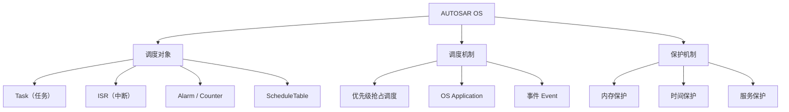

**AUTOSAR OS** 是 CP 的实时操作系统，基于行业标准 **OSEK/VDX（ISO 17356-3）** 扩展而来，并规定了对该标准的使用限制。它是**静态配置、静态伸缩**的实时内核，面向资源受限的汽车 ECU。

> [!info] 一句话定位
> CP 的「心脏」：优先级调度 + 运行期保护（内存 / 时间），可跑在低端控制器上且不依赖外部资源。

## 规范信息

| 项目 | 内容 |
| --- | --- |
| 平台 | CP |
| 类别 | SWS — 软件模块规范（Software Specification） |
| UID | 034 |
| 版本 | R25-11 |
| 本地 PDF | [AUTOSAR_CP_SWS_OS.pdf](file:///F:/Work/Standards/01_Sources/CP_SWS_OS_034/AUTOSAR_CP_SWS_OS.pdf) |
| 纯文本全文 | [CP_SWS_OS.complete.txt](file:///F:/Work/Standards/01_Sources/CP_SWS_OS_034/zzgen/CP_SWS_OS.complete.txt) |

## 知识体系

## 核心要点

- **基本特征**：静态配置与伸缩、可推理的实时性能、基于优先级的调度、运行期保护功能（内存 / 时间等）、可托管于低端控制器且无需外部资源。
- **与标准的关系**：以 ISO 17356-3（OSEK/VDX OS）为基础，本文档规定其**扩展与限制**。Telematics / 信息娱乐系统仍可能用私有 OS（Windows CE、VxWorks、QNX），此时应以 **OSAL（OS 抽象层）** 提供本文档定义的接口。
- **计数器与时间**：OS 可直接使用定时器单元驱动 Counter；若需由全局时间驱动调度或同步 ScheduleTable，需借助全局时间中断与 `SyncScheduleTable` 服务。
- **与 RTE / IOC 的关系**：IOC 提供 OS-Application 之间的通信，其生成依赖 RTE 生成器输出的配置；RTE 则调用 IOC 生成的函数传数据。
- **分区依赖**：若使用 OS-Application，OS 依赖虚拟模块 `EcuC` 对分区与核心的定义。

## 依赖关系

- 依赖 `EcuC`（分区 / 核心定义）。
- 被 [[RTE]]、[[ECUStateManager]]、[[BSWDistributionGuide]]（分区保护）等大量模块依赖。

## 相关

- [[RTE]]
- [[ECUStateManager]]
- [[BSWDistributionGuide]]
- [[处理器架构]]
- [[RTOS]]
- [[CP]]
- [[规范模块]]
