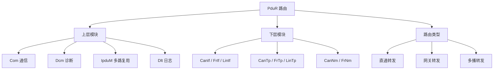

**PduR（PDU Router，PDU 路由器）** 是 CP 通信栈的**枢纽**：在「上层模块」（如 Com、Dcm、IpduM、Dlt）与「下层模块」（如 CanIf、FrIf、LinTp、CanNm）之间转发 **I-PDU**。路由完全基于**静态配置的 I-PDU 标识符**，运行时不做动态路由。

> [!info] 一句话定位
> 「这个 PDU 该交给谁」——通信栈里唯一负责路由的模块，也是网关转发的实现处。

## 规范信息

| 项目 | 内容 |
| --- | --- |
| 平台 | CP |
| 类别 | SWS — 软件模块规范（Software Specification） |
| UID | 035 |
| 版本 | R25-11 |
| 本地 PDF | [AUTOSAR_CP_SWS_PDURouter.pdf](file:///F:/Work/Standards/01_Sources/CP_SWS_PDURouter_035/AUTOSAR_CP_SWS_PDURouter.pdf) |
| 纯文本全文 | [CP_SWS_PDURouter.complete.txt](file:///F:/Work/Standards/01_Sources/CP_SWS_PDURouter_035/zzgen/CP_SWS_PDURouter.complete.txt) |

## 知识体系

## 核心要点

- **按 I-PDU 标识静态路由**：不依赖负载内容动态路由。
- **两大模块类型**：
  - 通信接口模块：使用 `<Provider:Up>` / `<Provider:Lo>` API（如 Com、IpduM、CanNm、FrNm、LSduR）；
  - 传输协议模块：使用 `<Provider:UpTp>` / `<Provider:LoTp>` API（如 J1939Tp、CanTp、FrTp、LinTp）。
- **上层与下层的「相对性」**：IpduM 同时是上层与下层（对 Com 是下层，对底层通信接口是上层）。
- **通用可扩展**：基于「被接口模块」的通用方法，被接口模块在 PduR 配置中指定，可方便支持其它上下层模块，甚至把 **CDD** 集成为上下层。
- **常见配对**：Dcm ↔ 传输协议；Com ↔ 通信接口 / 传输协议 / IpduM；IpduM ↔ 通信接口。

## 依赖关系

- 依赖下层通信硬件抽象模块 API（`<Lo>_Transmit`、`<LoTp>_Transmit` 等），被 [[COM]]、[[DiagnosticCommunicationManager]] 等上层使用；与 [[CANInterface]] 直连。

## 相关

- [[COM]]
- [[CANInterface]]
- [[DiagnosticCommunicationManager]]
- [[CP]]
- [[规范模块]]
