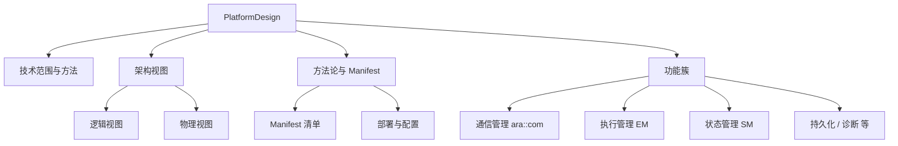

**PlatformDesign（自适应平台设计）** 是 AP 的**总览性解释文档**，面向 AP 的使用者与实现者，介绍 AP 的整体设计与关键概念：从技术范围与方法切入，给出 AP 的**逻辑视图与物理视图**，再逐一介绍方法论、Manifest 以及各个功能簇（Functional Cluster）。

> [!info] 一句话定位
> **AP 入门首选**：想学自适应平台，先读这一篇建立全局观，再进具体功能簇。

## 规范信息

| 项目 | 内容 |
| --- | --- |
| 平台 | AP |
| 类别 | EXP — 解释性指南（Explanation） |
| UID | 706 |
| 版本 | R25-11 |
| 本地 PDF | [AUTOSAR_AP_EXP_PlatformDesign.pdf](file:///F:/Work/Standards/01_Sources/AP_EXP_PlatformDesign_706/AUTOSAR_AP_EXP_PlatformDesign.pdf) |
| 纯文本全文 | [AP_EXP_PlatformDesign.complete.txt](file:///F:/Work/Standards/01_Sources/AP_EXP_PlatformDesign_706/zzgen/AP_EXP_PlatformDesign.complete.txt) |

## 知识体系

## 核心要点

- **文档定位**：提供 AP 的**总览**而非所有细节，目标是给出整体设计与关键概念，面向 AP 使用者与实现者。
- **组织结构**：先讲技术范围与方法（背景）→ 架构（逻辑视图 + 物理视图）→ 方法论与 Manifest → 各功能簇（每个功能簇含总览与关键概念介绍）。
- **细节去向**：具体规范与讨论分散在相关的 RS、SWS、TR、EXP 文档中——本笔记库中对应 [[SWArchitecture]]、[[ARAComAPI]]、[[CommunicationManagement]]、[[Core]]、[[ExecutionManagement]]、[[StateManagement]] 等。
- **前置阅读**：属于 AUTOSAR 高层概念文档，建议先读一些通用前置文档。

## 依赖关系

- 是理解 [[SWArchitecture]]、[[ARAComAPI]] 等 AP 文档的入口；引出 [[CommunicationManagement]]、[[ExecutionManagement]]、[[StateManagement]] 等功能簇。

## 相关

- [[SWArchitecture]]
- [[ARAComAPI]]
- [[CommunicationManagement]]
- [[AP]]
- [[规范模块]]
