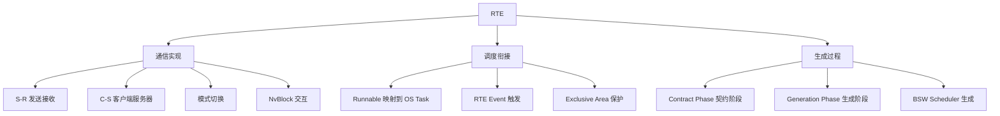

**RTE（Runtime Environment，运行时环境）** 是 AUTOSAR CP 最核心、也最容易让人望而生畏的模块。一句话定位：**RTE 是虚拟功能总线（VFB）在具体 ECU 上的实现，是应用层 SWC 与 BSW/OS 之间唯一合法的通道**。它不是手写的，而是由 RTE 生成器根据 SWC 描述与系统配置**自动生成**的代码（`rte.c` / `rte.h`）。

> [!info] 一句话定位
> RTE = VFB 的落地实现：向上给 SWC 生成统一的通信 API，向下封装 OS 与 COM 等服务。

## 规范信息

| 项目 | 内容 |
| --- | --- |
| 平台 | CP |
| 类别 | SWS — 软件模块规范（Software Specification） |
| UID | 084 |
| 版本 | R25-11 |
| 本地 PDF | [AUTOSAR_CP_SWS_RTE.pdf](file:///F:/Work/Standards/01_Sources/CP_SWS_RTE_084/AUTOSAR_CP_SWS_RTE.pdf) |
| 纯文本全文 | [CP_SWS_RTE.complete.txt](file:///F:/Work/Standards/01_Sources/CP_SWS_RTE_084/zzgen/CP_SWS_RTE.complete.txt) |

## 知识体系

## 核心要点

- **两大职能**：① **通信实现**（SWC 端口间的数据 / 操作传递）；② **调度衔接**（Runnable → OS Task 的映射与触发）。
- **四种通信范式**：
  | 接口类型 | 语义 | 典型 API |
  | --- | --- | --- |
  | Sender-Receiver（S-R） | 数据广播，1 发 N 收 | `Rte_Write / Rte_Read / Rte_Send / Rte_Receive` |
  | Client-Server（C-S） | 请求-应答（函数调用） | `Rte_Call / Rte_Result` |
  | Mode-Switch | 模式通知 / 请求 | `Rte_Switch / Rte_Mode` |
  | NvBlock / Parameter | 非易失块与校准参数 | `Rte_Prm / Rte_Pim` |
- **显式 vs 隐式访问**：显式由 SWC 自己调用 API；隐式由 RTE 在 Runnable 运行前后自动拷贝数据（一致性最好，默认方式）。non-queued 用于状态量（读最新值），queued 用于事件量（逐条处理）。
- **只支持静态通信**：所有连接在生成期确定，不支持运行时动态重配置。
- **触发即调度**：RTE Event（`TimingEvent` / `DataReceivedEvent` / `OperationInvokedEvent` / `InitEvent` 等）触发 Runnable，RTE 生成的 task body 依次调用 Runnable 壳函数。
- **生成两个阶段**：**RTE Contract Phase** 生成应用头文件（组件与 RTE 的「契约」）；**RTE Generation Phase** 生成 RTE 代码（每个 ECU 一份）。此外还有 BSW Scheduler（`SchM_*` API）的生成。
- **跨 ECU 时 RTE 不直接发报文**：`Rte_Write` 只写入 COM 的信号缓存，真正打包发送由 COM 的周期任务完成。

## 依赖关系

- **强耦合**：VFB（虚拟功能总线）、[[SoftwareComponentTemplate]]（SWC 描述是生成输入）、[[COM]]、[[OS]]、[[ECUStateManager]]、[[ECUConfiguration]]、[[SystemTemplate]]、AUTOSAR 方法论。

## 相关

- [[核心理念]]
- [[软件架构]]
- [[SoftwareComponentTemplate]]
- [[COM]]
- [[OS]]
- [[ECUConfiguration]]
- [[CP]]
- [[规范模块]]
