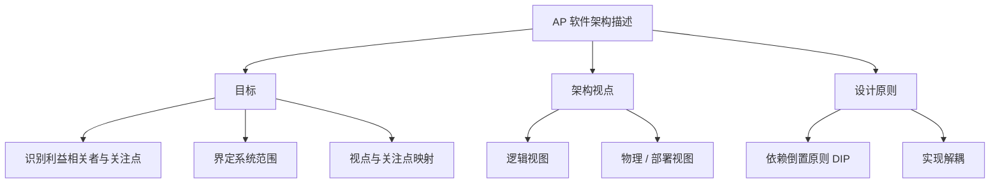

**SWArchitecture（自适应平台软件架构）** 是 AP 解释文档，按架构描述标准给出自适应平台的**软件架构模型**：识别利益相关者与关注点、界定系统范围、定义架构视点（Viewpoint）与视图（View），并给出架构决策依据。

> [!info] 一句话定位
> AP 的「架构说明书」：用标准化的视点 / 视图方法，把自适应平台的软件结构讲清楚。

## 规范信息

| 项目 | 内容 |
| --- | --- |
| 平台 | AP |
| 类别 | EXP — 解释性指南（Explanation） |
| UID | 982 |
| 版本 | R25-11 |
| 本地 PDF | [AUTOSAR_AP_EXP_SWArchitecture.pdf](file:///F:/Work/Standards/01_Sources/AP_EXP_SWArchitecture_982/AUTOSAR_AP_EXP_SWArchitecture.pdf) |
| 纯文本全文 | [AP_EXP_SWArchitecture.complete.txt](file:///F:/Work/Standards/01_Sources/AP_EXP_SWArchitecture_982/zzgen/AP_EXP_SWArchitecture.complete.txt) |

## 知识体系

## 核心要点

- **文档目标**：识别 AP 的利益相关者及其关注点；界定系统范围并给出总览；定义所用架构视点并把关注点映射到视点；为每个视点给出架构视图与模型；提供视图间的一致性规则（correspondence rules）；给出高层架构决策依据（rationale）。
- **依赖倒置原则（DIP）**：高层构建块不应依赖低层构建块，二者都应依赖抽象（接口）；抽象不应依赖细节，细节（具体实现）应依赖抽象。该原则带来**实现解耦**，有利于扩展实现工作与开展集成测试。
- **更深入的内容**：更详细的决策说明另见架构决策文档 [SWArchitecturalDecisions](file:///F:/Work/AUTOSAR_Module_Notes/FO/EXP/SWArchitecturalDecisions.md)。

## 依赖关系

- 与 [[PlatformDesign]]（总体设计）互补；与 [[CommunicationManagement]]、[[ExecutionManagement]]、[[StateManagement]] 等功能簇架构相关。

## 相关

- [[PlatformDesign]]
- [[软件架构]]
- [[AP]]
- [[FO]]
- [[规范模块]]
