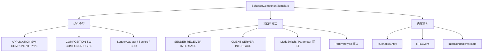

**SoftwareComponentTemplate（软件组件模板）** 是 CP 模板规范（TPS），定义如何用 ARXML 描述**软件组件（SWC）**：组件类型、端口与接口、内部行为（Runnable）、数据类型，以及组件之间的连接。它是 [[RTE]] 代码生成的**直接输入**。

> [!info] 一句话定位
> SWC 的「建模语言」：把「这个组件有什么端口、跑什么可运行实体」写成 ARXML，喂给 RTE 生成器。

## 规范信息

| 项目 | 内容 |
| --- | --- |
| 平台 | CP |
| 类别 | TPS — 模板规范（Template Specification） |
| UID | 062 |
| 版本 | R25-11 |
| 本地 PDF | [AUTOSAR_CP_TPS_SoftwareComponentTemplate.pdf](file:///F:/Work/Standards/01_Sources/CP_TPS_SoftwareComponentTemplate_062/AUTOSAR_CP_TPS_SoftwareComponentTemplate.pdf) |
| 纯文本全文 | [CP_TPS_SoftwareComponentTemplate.complete.txt](file:///F:/Work/Standards/01_Sources/CP_TPS_SoftwareComponentTemplate_062/zzgen/CP_TPS_SoftwareComponentTemplate.complete.txt) |

## 知识体系

## 核心要点

- **概念集中地**：本模板把大量概念性说明集中在一章，便于理解后续章节，但不作为阅读后续章节的前置条件。
- **核心元类**：
  - 组件类型：`APPLICATION-SW-COMPONENT-TYPE`（应用组件）、`COMPOSITION-SW-COMPONENT-TYPE`（组合 / 装配体）等；
  - 接口与端口：`SENDER-RECEIVER-INTERFACE`（数据类）、`CLIENT-SERVER-INTERFACE`（调用类）、模式切换 / 参数接口，以及 `PortPrototype`；
  - 内部行为：`RunnableEntity`（可运行实体）、`RTEEvent`（触发事件）、`InterRunnableVariable`（组件内传值）。
- **数据依赖**：`SwDataDependency` 可声明数据元素之间的依赖关系（如由其它标定参数自动推导某个参数的值），依赖参数本身不应可单独调整。

## 依赖关系

- 是 [[RTE]] 生成的核心输入；与 [[SystemTemplate]]（系统级连接）、[[ECUConfiguration]]（配置参数）配合。

## 相关

- [[RTE]]
- [[SystemTemplate]]
- [[ECUConfiguration]]
- [[软件架构]]
- [[CP]]
- [[规范模块]]
