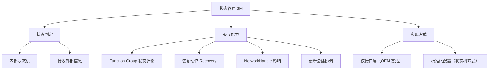

**State Management（状态管理，SM）** 是 AP Services 里的功能簇，根据从其它自适应应用收到的信息**判定自身状态机（State Machine）的状态**，并驱动功能组的**状态迁移（Function Group State Transition）**、恢复动作、网络句柄影响与更新会话协调。

> [!info] 一句话定位
> AP 的「状态指挥官」：决定整个软件系统此刻处于哪个功能组状态，并推动系统迁移过去。

## 规范信息

| 项目 | 内容 |
| --- | --- |
| 平台 | AP |
| 类别 | SWS — 软件模块规范（Software Specification） |
| UID | 908 |
| 版本 | R25-11 |
| 本地 PDF | [AUTOSAR_AP_SWS_StateManagement.pdf](file:///F:/Work/Standards/01_Sources/AP_SWS_StateManagement_908/AUTOSAR_AP_SWS_StateManagement.pdf) |
| 纯文本全文 | [AP_SWS_StateManagement.complete.txt](file:///F:/Work/Standards/01_Sources/AP_SWS_StateManagement_908/zzgen/AP_SWS_StateManagement.complete.txt) |

## 知识体系

## 核心要点

- **职责**：根据来自其它自适应平台应用 / 自适应应用的信息，判定内部各状态机的状态。
- **与其它应用的交互**：
  - 请求 **Function Group 状态迁移**（含恢复动作）；
  - 受 **NetworkHandle** 影响状态；
  - 支持**协同更新会话**：按当前更新会话阶段把功能组迁移到不同状态。
  这些交互通过 `ara::com` 服务接口与 C++ API 实现。
- **高度 OEM / 项目特定**：规范给出两种使用方式——① 只定义**接口层**，内部逻辑与配置由 OEM 灵活实现；② 提供**标准化的配置管理**，以**状态机（StateMachine）**方式定义配置如何与内部逻辑交互。
- **内部接口**：与其它功能簇之间不作语法标准化，仅信息性指引。

## 依赖关系

- 通过 `ara::com` 与其它应用交互，依赖 [[ExecutionManagement]]（进程启停）与更新管理（UCM）实现状态迁移。

## 相关

- [[ExecutionManagement]]
- [[CommunicationManagement]]
- [[PlatformDesign]]
- [[AP]]
- [[规范模块]]
