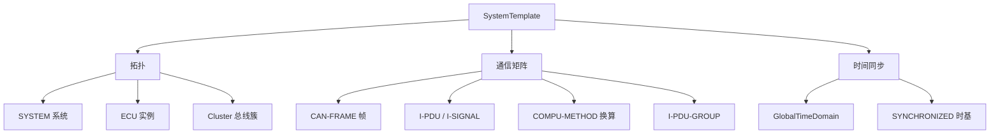

**SystemTemplate（系统模板）** 是 CP 模板规范（TPS），用 ARXML 元模型描述**整车 / 系统级视图**：软件组件及其连接、运行在哪些 ECU 上、总线的通信矩阵、以及系统级的时间同步等。它是「从整车设计到单 ECU 提取（ECU Extract）」的输入。

> [!info] 一句话定位
> 整车软件拓扑的「设计图纸」：先在这里定义系统，再提取成每个 ECU 的配置输入。

## 规范信息

| 项目 | 内容 |
| --- | --- |
| 平台 | CP |
| 类别 | TPS — 模板规范（Template Specification） |
| UID | 063 |
| 版本 | R26-11 |
| 本地 PDF | [AUTOSAR_CP_TPS_SystemTemplate.pdf](file:///F:/Work/Standards/01_Sources/CP_TPS_SystemTemplate_063/AUTOSAR_CP_TPS_SystemTemplate.pdf) |
| 纯文本全文 | [CP_TPS_SystemTemplate.complete.txt](file:///F:/Work/Standards/01_Sources/CP_TPS_SystemTemplate_063/zzgen/CP_TPS_SystemTemplate.complete.txt) |

## 知识体系

## 核心要点

- **系统描述建模**：用 `SYSTEM` 定义整车系统；用总线簇（如 `CAN-CLUSTER`）与帧触发（`CAN-FRAME-TRIGGERING`）定义帧与总线通道。
- **信号链**：`CAN-FRAME` 内装 I-PDU，I-PDU 内是 `I-SIGNAL`；每个信号可挂 **`COMPU-METHOD`**（物理值 ↔ 原始值换算）与单位 `UNIT`。
- **通信分组**：`I-PDU-GROUP`（COMMUNICATION-GROUP）声明某 I-PDU 何时启用（如上电即发、还是网络管理唤醒后发）。
- **全局时间同步**：`GlobalTimeDomain` 的 category 可取值 **SYNCHRONIZED**（该时基不依赖其它时基）。典型用途：事故后的事后分析（需可靠全局时基才能确定崩溃前活动顺序）、多 ECU 协同执行、以及多个全局时基的并行分发（如车辆本地时间 + GPS 时间）。
- **产出**：系统描述的拆分产生 **ECU Extract**（单 ECU 子集），是后续 [[ECUConfiguration]] 的输入。

## 依赖关系

- 输入给 [[ECUConfiguration]]；与 [[SoftwareComponentTemplate]]（SWC 描述）、[[COM]] / [[PDURouter]] / [[CANInterface]]（通信参数来源）相关。

## 相关

- [[SoftwareComponentTemplate]]
- [[ECUConfiguration]]
- [[方法论]]
- [[CP]]
- [[规范模块]]
