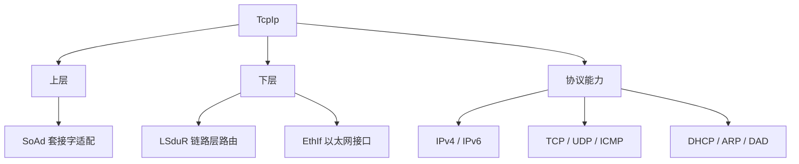

**TcpIp（TCP/IP Stack，TCP/IP 协议栈）** 是 CP 基础软件模块，提供收发 **Internet Protocol 数据**的能力，位于 **SoAd（Socket Adaptor）** 与 **LSduR（Linklayer SDU Routing）** 之间，通过 LSduR 与 **EthIf（Ethernet Interface）** 交换 L-SDU。

> [!info] 一句话定位
> 车载以太网的「网络层 / 传输层」：CAN 之外，AUTOSAR CP 通往 IP 世界的大门。

## 规范信息

| 项目 | 内容 |
| --- | --- |
| 平台 | CP |
| 类别 | SWS — 软件模块规范（Software Specification） |
| UID | 617 |
| 版本 | R25-11 |
| 本地 PDF | [AUTOSAR_CP_SWS_TcpIp.pdf](file:///F:/Work/Standards/01_Sources/CP_SWS_TcpIp_617/AUTOSAR_CP_SWS_TcpIp.pdf) |
| 纯文本全文 | [CP_SWS_TcpIp.complete.txt](file:///F:/Work/Standards/01_Sources/CP_SWS_TcpIp_617/zzgen/CP_SWS_TcpIp.complete.txt) |

## 知识体系

## 核心要点

- **定位**：位于 SoAd 与 LSduR 之间；通过 LSduR 与 EthIf 交换 L-SDU。
- **功能**：提供 Internet Protocol 数据的收发能力。
- **常见缩写**：DAD（重复地址检测）、DHCPv4 / DHCPv6、EthIf、EthSM（以太网状态管理）、HSM（硬件安全模块）等。

## 依赖关系

- 依赖 LSduR / [[CANInterface]] 之上层 [[PDURouter]]（以太网场景经 EthIf）；为 SoAd 提供 TCP/IP 能力，进而支撑 SOME/IP 与 OTA 等。

## 相关

- [[SOMEIPTransformer]]
- [[PDURouter]]
- [[AP]]
- [[CP]]
- [[规范模块]]
