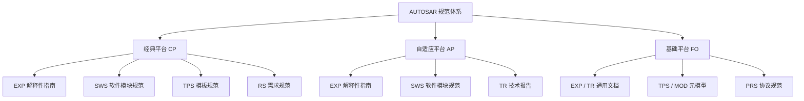

AUTOSAR 的规范体系按**三大平台**组织：**经典平台（CP）**、**自适应平台（AP）**与**基础平台（FO，Foundation）**；每个平台下再按**文档类别**划分（EXP 解释性指南、SWS 软件模块规范、RS 需求规范、TPS 模板规范、TR 技术报告、MOD 元模型等）。这一层是通往 300+ 份官方规范的「地图」，用来快速定位某个模块「归谁管、规范叫什么、本地文件在哪」。

> [!info] 一句话定位
> 规范模块库 = AUTOSAR 的**规范地图**：先选平台（CP / AP / FO），再选类别，蕞后落到具体模块规范。

## 知识体系

## 三大平台对比

| 平台 | 定位 | 语言 / OS | 通信 | 入口 |
| --- | --- | --- | --- | --- |
| 经典平台 CP | 实时控制 ECU | C / AUTOSAR OS（OSEK） | CAN、LIN、FlexRay | [[CP]] |
| 自适应平台 AP | 高性能计算（域控 / 中央计算） | C++ / POSIX | SOME/IP、以太网 | [[AP]] |
| 基础平台 FO | CP 与 AP 共用的基础规范 | — | E2E、SOME/IP 协议 | [[FO]] |

## 核心模块速查（学习路线优先级）

| 优先级 | 模块 | 主题 | 平台 |
| --- | --- | --- | --- |
| 1 | [[BSWDistributionGuide]] | BSW 分布与多核部署指南 | CP |
| 2 | [[ModeManagementGuide]] | 模式管理指南（CP 核心概念） | CP |
| 3 | [[RTE]] | RTE 运行时环境（CP 核心） | CP |
| 4 | [[OS]] | 操作系统（OSEK 血统） | CP |
| 5 | [[ECUStateManager]] | ECU 状态管理（EcuM） | CP |
| 6 | [[BSWModeManager]] | BSW 模式管理（BswM） | CP |
| 7 | [[CANInterface]] | CAN 接口 | CP |
| 8 | [[PDURouter]] | PDU 路由器（通信栈枢纽） | CP |
| 9 | [[COM]] | COM 信号收发 | CP |
| 10 | [[COMManager]] | 通信管理器（ComM） | CP |
| 11 | [[DiagnosticCommunicationManager]] | 诊断通信管理（Dcm / UDS） | CP |
| 12 | [[DiagnosticEventManager]] | 诊断事件管理（Dem / DTC） | CP |
| 13 | [[NVRAMManager]] | NvRAM 管理（NvM） | CP |
| 14 | [[E2ELibrary]] | E2E 端到端保护库 | CP |
| 15 | [[TcpIp]] | TCP/IP 协议栈 | CP |
| 16 | [[SOMEIPTransformer]] | SOME/IP 序列化转换器 | CP |
| 17 | [[CryptoServiceManager]] | 加密服务管理器（CSM） | CP |
| 18 | [[SystemTemplate]] | 系统模板（系统描述建模） | CP |
| 19 | [[SoftwareComponentTemplate]] | 软件组件模板（SWC 建模） | CP |
| 20 | [[ECUConfiguration]] | ECU 配置参数定义 | CP |
| 21 | [[PlatformDesign]] | AP 平台设计总览（AP 入门首选） | AP |
| 22 | [[SWArchitecture]] | AP 软件架构视图 | AP |
| 23 | [[ARAComAPI]] | ara::com API 详解 | AP |
| 24 | [[CommunicationManagement]] | ara::com 通信管理 | AP |
| 25 | [[Core]] | ara::core 基础库 | AP |
| 26 | [[ExecutionManagement]] | 执行管理（EM） | AP |
| 27 | [[StateManagement]] | 状态管理（SM） | AP |

## 怎么用这套笔记

1. **入门**：先读 [[软件架构]] 与 [[核心理念]] 建立全局观，再进 [[BSWDistributionGuide]]、[[ModeManagementGuide]] 理解 CP 的分层与模式管理。
2. **做通信**：沿 [[COM]] → [[PDURouter]] → [[CANInterface]] 打通一条信号的配置链。
3. **做诊断**：[[DiagnosticCommunicationManager]]（UDS 交互）配 [[DiagnosticEventManager]]（故障存储）。
4. **做智能驾驶**：从 [[PlatformDesign]] 入门 AP，再读 [[ARAComAPI]]、[[CommunicationManagement]]。
5. **遇到配置参数**：把工具里的参数名在模块笔记里对照，再点开「本地规范」读原始 PDF。

> [!note] 本地规范库
> 每篇模块笔记都给出对应的**官方 PDF / ARXML / 纯文本全文**本地路径（指向 `F:\Work\Standards\01_Sources`），可直接点击打开原件。

## 相关

- [[AUTOSAR]]
- [[核心理念]]
- [[软件架构]]
- [[方法论]]
- [[标准与规范]]
- [[应用领域]]
