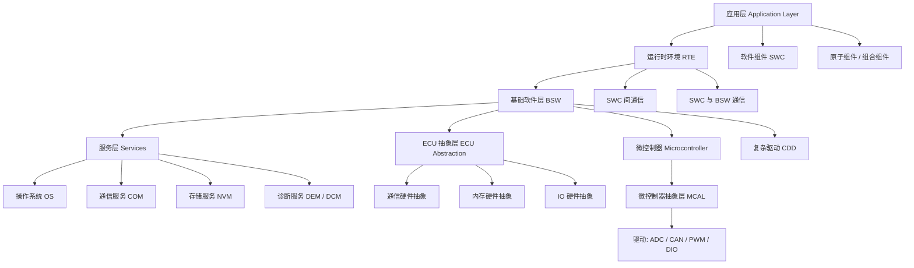
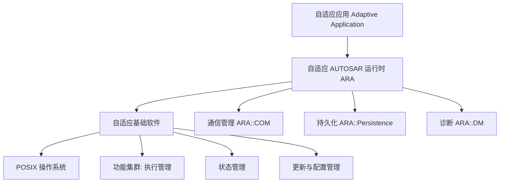

AUTOSAR 软件架构的核心是**分层（Layering）**：把整车软件从「贴近硬件的底层驱动」到「面向功能的应用逻辑」分成若干层，每层只依赖下层提供的标准接口。AUTOSAR 提供两套平台：面向实时控制的**经典平台（CP）**与面向高性能计算的**自适应平台（AP）**。

> [!info] 一句话定位
> CP 分层解决「实时控制软件的标准化」，AP 分层解决「智能汽车高算力软件的标准化」。

## 经典平台（CP）分层架构

### 各层职责

- **应用层（Application Layer）**：实现具体业务功能，由若干**软件组件（SWC）**构成。SWC 只通过端口收发数据，不关心通信实现。
- **RTE（Runtime Environment，运行时环境）**：应用层与基础软件之间的「中间人」，负责把 SWC 之间、SWC 与 BSW 之间的通信落地为实际的总线报文或函数调用。
- **BSW（Basic Software，基础软件层）**：提供操作系统、通信、存储、诊断等通用服务，进一步细分：
  - **服务层（Services）**：OS、COM、NVM、DEM/DCM 等。
  - **ECU 抽象层（ECU Abstraction）**：屏蔽具体 ECU 硬件差异。
  - **复杂驱动（CDD）**：标准接口覆盖不到的特殊外设驱动。
- **MCAL（Microcontroller Abstraction Layer，微控制器抽象层）**：最底层，直接操作寄存器，封装 ADC、CAN、PWM、DIO 等 MCU 外设驱动，是「换芯片只改这里」的关键。

## 自适应平台（AP）分层架构

### CP 与 AP 对比

| 维度 | 经典平台 CP | 自适应平台 AP |
| --- | --- | --- |
| 目标场景 | 实时控制（ECU） | 高性能计算（域控 / 中央计算） |
| 编程语言 | C | C++ |
| 操作系统 | AUTOSAR OS（OSEK） | POSIX（Linux 等） |
| 通信 | CAN / LIN / FlexRay | 面向服务（SOME/IP、以太网） |
| 更新方式 | 刷写整包 | 支持动态更新与部署 |

## 共享功能

加密技术、网络管理（NM）、时间同步等，在 CP 与 AP 中都以功能簇（Functional Cluster）形式提供。

## 相关

- [[AUTOSAR]]
- [[核心理念]]
- [[方法论]]
- [[应用领域]]
- [[新能源汽车]]
- [[CP]] ｜ [[AP]] ｜ [[规范模块]]
