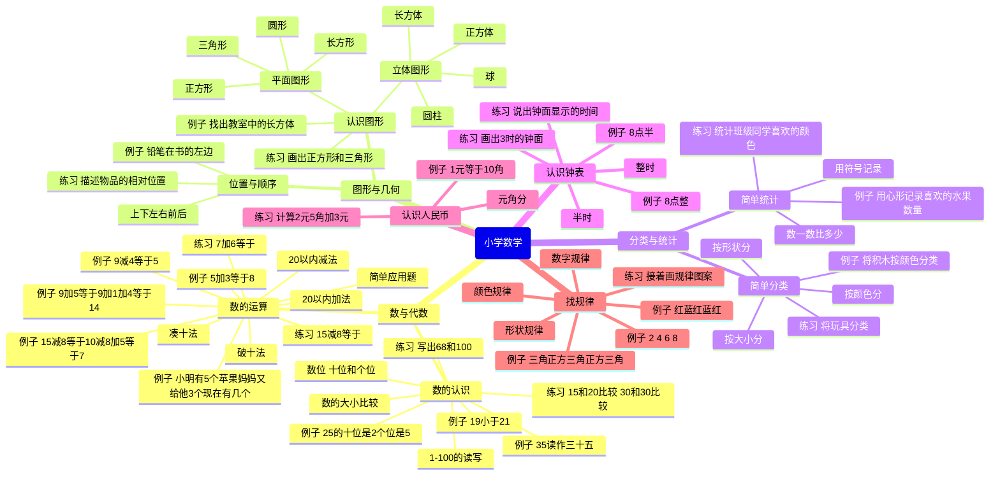

```mermaid
mindmap
  root(小学数学)
    数与代数
      数的认识
        1-100的读写
        例子 35读作三十五
        练习 写出68和100
        数位 十位和个位
        例子 25的十位是2个位是5
        数的大小比较
        例子 19小于21
        练习 15和20比较 30和30比较
      数的运算
        20以内加法
        例子 5加3等于8
        练习 7加6等于
        20以内减法
        例子 9减4等于5
        练习 15减8等于
        凑十法
        例子 9加5等于9加1加4等于14
        破十法
        例子 15减8等于10减8加5等于7
        简单应用题
        例子 小明有5个苹果妈妈又给他3个现在有几个
    图形与几何
      认识图形
        平面图形
          长方形
          正方形
          三角形
          圆形
        立体图形
          长方体
          正方体
          圆柱
          球
        例子 找出教室中的长方体
        练习 画出正方形和三角形
      位置与顺序
        上下左右前后
        例子 铅笔在书的左边
        练习 描述物品的相对位置
    分类与统计
      简单分类
        按颜色分
        按形状分
        按大小分
        例子 将积木按颜色分类
        练习 将玩具分类
      简单统计
        用符号记录
        例子 用心形记录喜欢的水果数量
        数一数比多少
        练习 统计班级同学喜欢的颜色
    认识钟表
      整时
      例子 8点整
      练习 画出3时的钟面
      半时
      例子 8点半
      练习 说出钟面显示的时间
    认识人民币
      元角分
      例子 1元等于10角
      练习 计算2元5角加3元
    找规律
      颜色规律
      例子 红蓝红蓝红
      形状规律
      例子 三角正方三角正方三角
      数字规律
      例子 2 4 6 8
      练习 接着画规律图案
```

> 资源下载

![[content/images/English1.png]]

* [点我⬇️](../../images/English1.png)