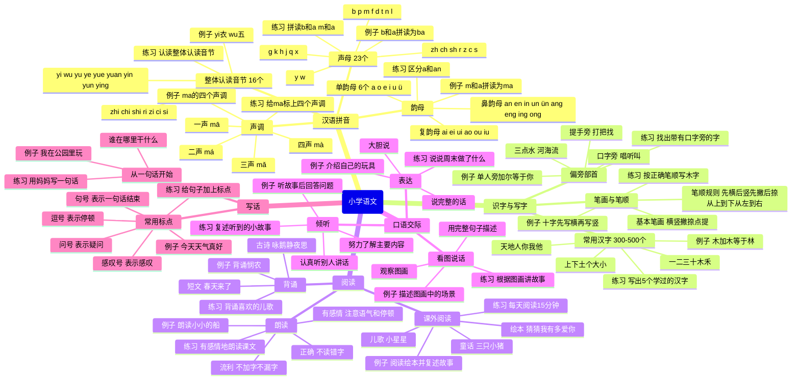

```mermaid
mindmap
  root(小学语文)
    汉语拼音
      声母 23个
        b p m f d t n l
        g k h j q x
        zh ch sh r z c s
        y w
        例子 b和a拼读为ba
        练习 拼读b和a m和a
      韵母
        单韵母 6个 a o e i u ü
        复韵母 ai ei ui ao ou iu
        鼻韵母 an en in un ün ang eng ing ong
        例子 m和a拼读为ma
        练习 区分a和an
      整体认读音节 16个
        zhi chi shi ri zi ci si
        yi wu yu ye yue yuan yin yun ying
        例子 yi衣 wu五
        练习 认读整体认读音节
      声调
        一声 mā
        二声 má
        三声 mǎ
        四声 mà
        例子 ma的四个声调
        练习 给ma标上四个声调
    识字与写字
      常用汉字 300-500个
        天地人你我他
        一二三十木禾
        上下土个大小
        例子 木加木等于林
        练习 写出5个学过的汉字
      笔画与笔顺
        基本笔画 横竖撇捺点提
        笔顺规则 先横后竖先撇后捺从上到下从左到右
        例子 十字先写横再写竖
        练习 按正确笔顺写木字
      偏旁部首
        口字旁 唱听叫
        提手旁 打把找
        三点水 河海流
        例子 单人旁加尔等于你
        练习 找出带有口字旁的字
    阅读
      朗读
        正确 不读错字
        流利 不加字不漏字
        有感情 注意语气和停顿
        例子 朗读小小的船
        练习 有感情地朗读课文
      背诵
        古诗 咏鹅静夜思
        短文 春天来了
        例子 背诵悯农
        练习 背诵喜欢的儿歌
      课外阅读
        绘本 猜猜我有多爱你
        童话 三只小猪
        儿歌 小星星
        例子 阅读绘本并复述故事
        练习 每天阅读15分钟
    口语交际
      倾听
        认真听别人讲话
        努力了解主要内容
        例子 听故事后回答问题
        练习 复述听到的小故事
      表达
        大胆说
        说完整的话
        例子 介绍自己的玩具
        练习 说说周末做了什么
      看图说话
        观察图画
        用完整句子描述
        例子 描述图画中的场景
        练习 根据图画讲故事
    写话
      从一句话开始
        谁在哪里干什么
        例子 我在公园里玩
        练习 用妈妈写一句话
      常用标点
        逗号 表示停顿
        句号 表示一句话结束
        问号 表示疑问
        感叹号 表示感叹
        例子 今天天气真好
        练习 给句子加上标点

```

---

> 资源下载

![[Chinese1.png]]

* [点我⬇️](../../images/Chinese1.png)
