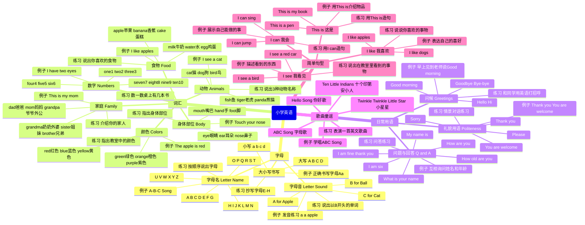

```mermaid
mindmap
  root(小学英语)
    字母
      字母名 Letter Name
        A B C D E F G
        H I J K L M N
        O P Q R S T
        U V W X Y Z
        例子 A-B-C Song
        练习 按顺序说出字母
      字母音 Letter Sound
        A for Apple
        B for Ball
        C for Cat
        例子 发音练习 a a apple
        练习 说出以B开头的单词
      大小写书写
        大写 A B C D
        小写 a b c d
        例子 正确书写字母Aa
        练习 抄写字母E-H
    词汇
      动物 Animals
        cat猫 dog狗 bird鸟
        fish鱼 tiger老虎 panda熊猫
        例子 I see a cat
        练习 说出3种动物名称
      颜色 Colors
        red红色 blue蓝色 yellow黄色
        green绿色 orange橙色 purple紫色
        例子 The apple is red
        练习 指出教室中的颜色
      数字 Numbers
        one1 two2 three3
        four4 five5 six6
        seven7 eight8 nine9 ten10
        例子 I have two eyes
        练习 数一数桌上有几本书
      食物 Food
        apple苹果 banana香蕉 cake蛋糕
        milk牛奶 water水 egg鸡蛋
        例子 I like apples
        练习 说出你喜欢的食物
      身体部位 Body
        eye眼睛 ear耳朵 nose鼻子
        mouth嘴巴 hand手 foot脚
        例子 Touch your nose
        练习 指出身体部位
      家庭 Family
        dad爸爸 mom妈妈 grandpa爷爷外公
        grandma奶奶外婆 sister姐妹 brother兄弟
        例子 This is my mom
        练习 介绍你的家人
    日常用语
      问候 Greetings
        Hello Hi
        Good morning
        Goodbye Bye-bye
        例子 早上见到老师说Good morning
        练习 和同学用英语打招呼
      礼貌用语 Politeness
        Please
        Thank you
        You are welcome
        Sorry
        例子 Thank you You are welcome
        练习 情景对话练习
      问题与回答 Q and A
        What is your name
        My name is
        How are you
        I am fine thank you
        How old are you
        I am six
        例子 互相询问姓名和年龄
        练习 问答练习
    歌曲童谣
      ABC Song 字母歌
      Hello Song 你好歌
      Ten Little Indians 十个印第安小人
      Twinkle Twinkle Little Star 小星星
      例子 学唱ABC Song
      练习 表演一首英文歌曲
    简单句型
      This is 这是
        This is my book
        This is a pen
        例子 用This is介绍物品
        练习 用This is造句
      I like 我喜欢
        I like apples
        I like dogs
        例子 表达自己的喜好
        练习 说说你喜欢的事物
      I can 我会
        I can sing
        I can jump
        例子 展示自己能做的事
        练习 用I can造句
      I see 我看见
        I see a bird
        I see a red car
        例子 描述看到的东西
        练习 说出在教室里看到的事物
```

---

> 资源下载

![[english1.png]]