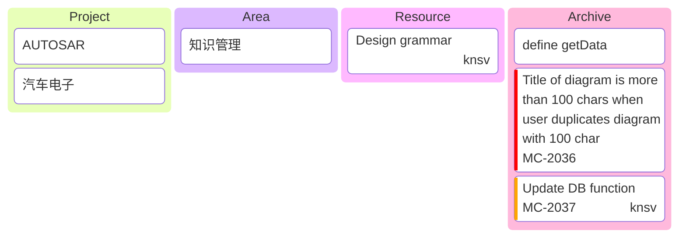

使用`PARA`搭建[[数字花园]]

## 🪴 数字花园

| 层级 | 英文全称 | 中文含义 | 描述                                                                            | 示例                                                              |
| ---- | -------- | -------- | ------------------------------------------------------------------------------- | ----------------------------------------------------------------- |
| P    | [[Project]]  | 项目     | 有明确目标、截止日期的一系列任务。 这是你当前正在积极推动的工作。               | - 完成季度财报   - 撰写一篇博客文章   - 策划一场婚礼              |
| A    | [[Area]]    | 领域     | 需要长期维持并关注标准的重要活动领域。 它们没有终点，但需要持续投入。           | - 健康管理  - 个人财务   - 学习法语                               |
| R    | [[Resource]] | 资源     | 来可能感兴趣的主题或素材。 这是你的知识库或灵感池，目前没有明确项目与之关联。   | - 关于区块链的阅读清单     - 网页设计灵感图库                     |
| A    | [[Archive]]  | 存档     | 来自其他三个类别的非活动项目。 已完成的项目、不再负责的领域、不再感兴趣的资源。 | - 已完成的项目文档      - 旧工作的文件           - 过去研究的笔记 |

## 🔧 PARA

## 🚧 关于

