> Markdown语言的基础操作


## 1.基础操作

### 1.1.标题

| 标题     | 符号 |
| -------- | ---- |
| 一级标题 | `#`  |
| 二级标题 | `##` |
| 三级标题 | `#`  |
| 四级标题 | `#`  |
| 一级标题 | `#`  |
| 一级标题 | `#`  |


##  1.2.文本


# 2.mermaid操作

> 参考官网 [mermaid](https://mermaid.js.org/intro/)

```markdown
mermaid语法
```


> 状态图


> 流程图

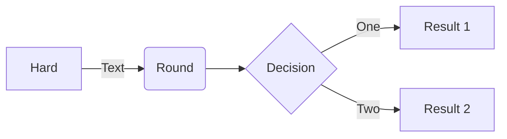

> 时序图
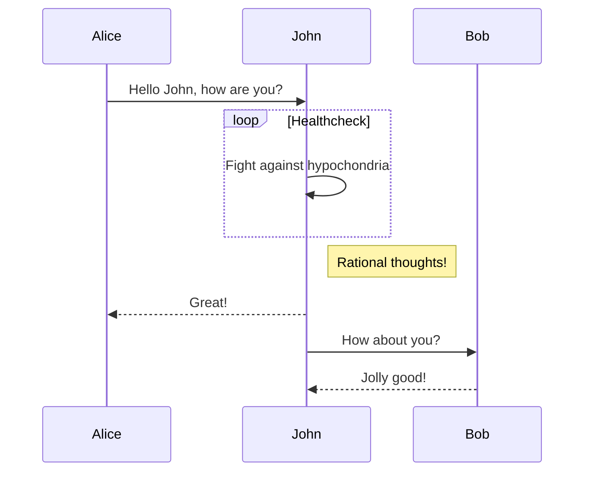


> 甘特图

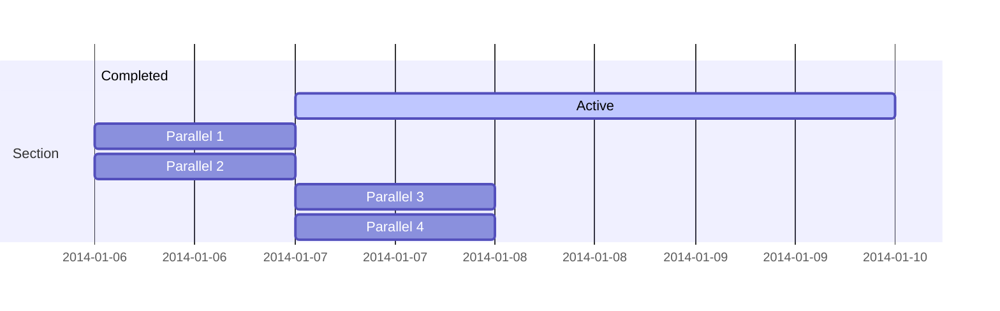

>类图

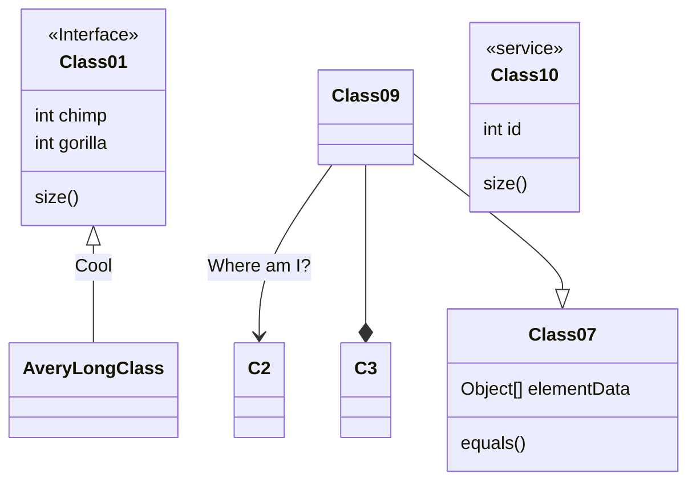


>饼图

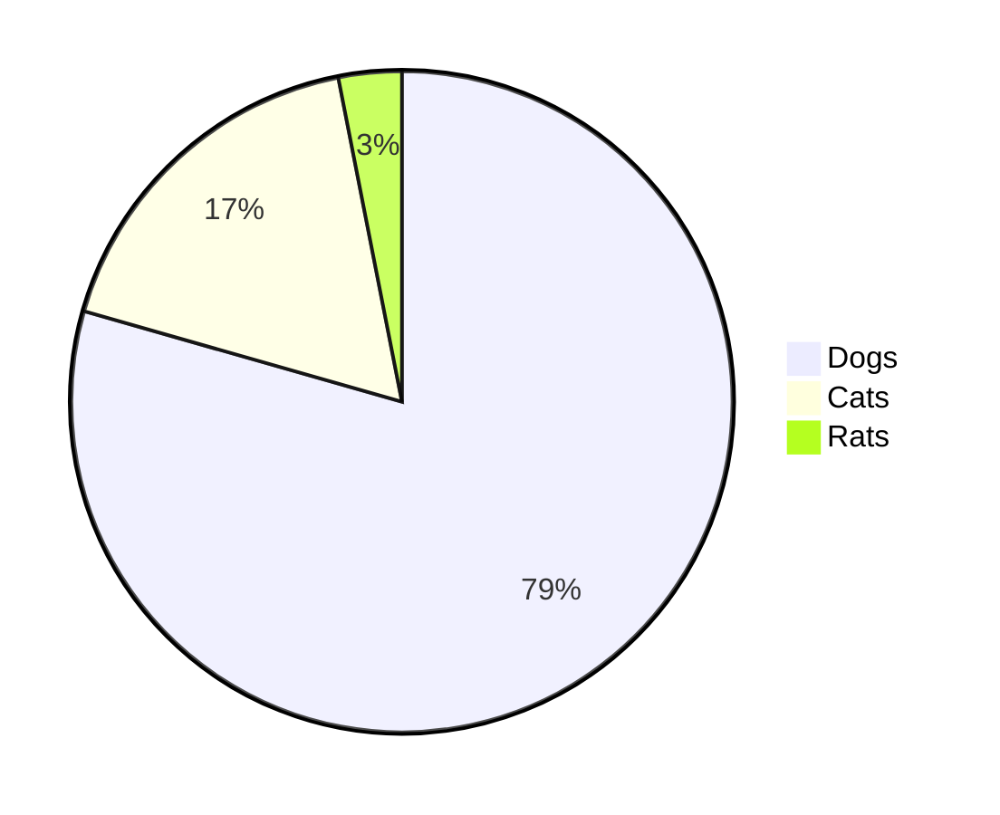


>C4 图

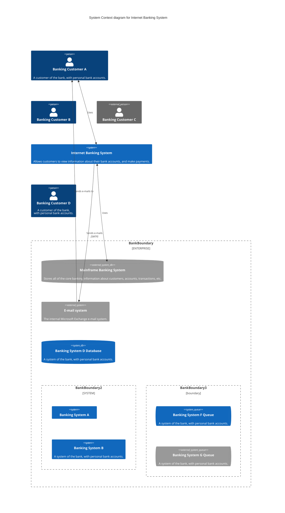


>Git 图

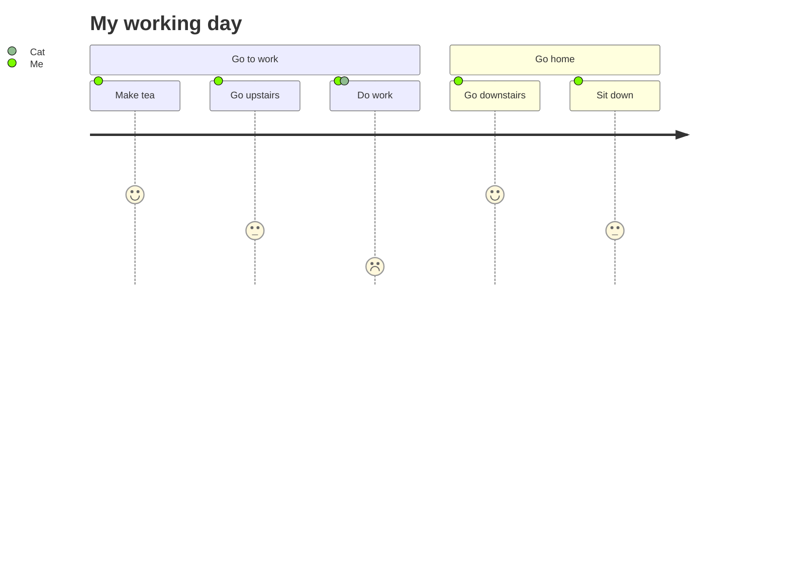


> 思维导图

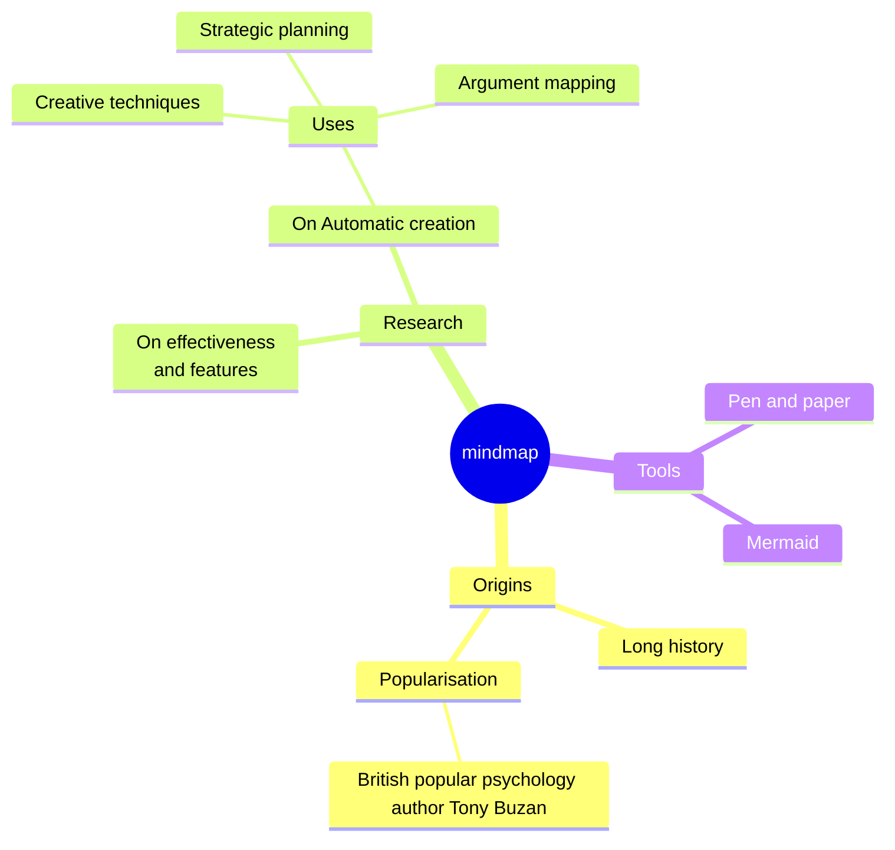


# 3.UML


## 3.1 时序图

1. 基本例子

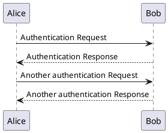

2.声明参与者

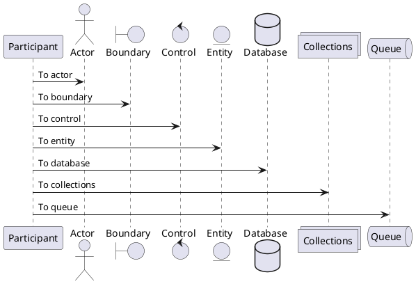


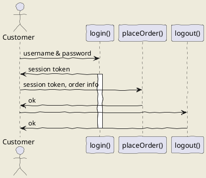

## 3.2 用例图

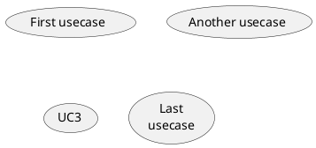


# 4.插入音乐

<!-- 注释 -->

<html>

<iframe frameborder="no" border="0" marginwidth="0" marginheight="0" width=330 height=86 src="//music.163.com/outchain/player?type=2&id=1853344178&auto=1&height=66"></iframe>

</html>