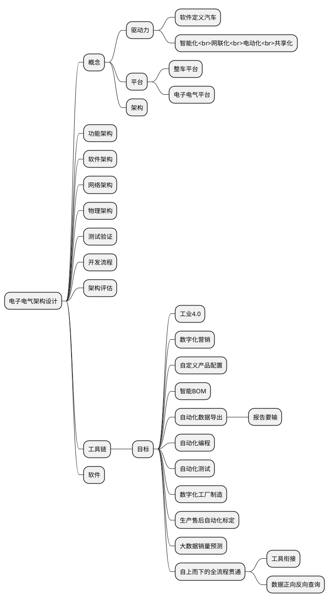

> 汽车电子学习架构

```plantuml
@startmindmap
* 电子电气架构设计
** 概念
*** 驱动力
**** 软件定义汽车
**** 智能化<br>网联化<br>电动化<br>共享化
*** 平台
**** 整车平台
**** 电子电气平台
*** 架构
** 功能架构
** 软件架构
** 网络架构
** 物理架构
** 测试验证
** 开发流程
** 架构评估
** 工具链
*** 目标
**** 工业4.0
**** 数字化营销
**** 自定义产品配置
**** 智能BOM
**** 自动化数据导出
***** 报告要输
**** 自动化编程
**** 自动化测试
**** 数字化工厂制造
**** 生产售后自动化标定
**** 大数据销量预测
**** 自上而下的全流程贯通
*****  工具衔接
*****  数据正向反向查询
** 软件
@endmindmap


```

