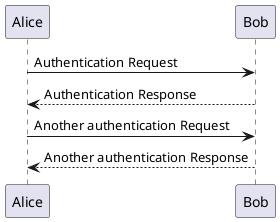
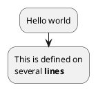
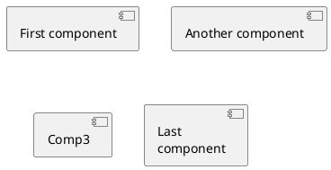

* 序列图

```plantuml
@startuml
Alice -> Bob: Authentication Request
Bob --> Alice: Authentication Response

Alice -> Bob: Another authentication Request
Alice <-- Bob: Another authentication Response
@enduml

```
* 用例图
* 类图
* 对象图
* 活动图

```plantuml
@startuml
:Hello world;
:This is defined on
several **lines**;
@enduml

```
* 组件图

```plantuml
@startuml

[First component]
[Another component] as Comp2
component Comp3
component [Last\ncomponent] as Comp4

@enduml

```
* 部署图
* 状态图
* 时序图