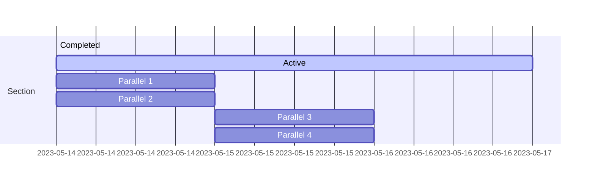

> 计划管理

---

## 阶段学习任务安排

```mermaid
      gantt
          section Section
          Completed :done,    des1, 2023-05-14,2023-12-31
          Active        :active, des2, 2023-05-14, 3d
          Parallel 1   :         des3, after des1, 1d
          Parallel 2   :         des4, after des1, 1d
          Parallel 3   :         des5, after des3, 1d
    Parallel 4   :         des6, after des4, 1d

```

